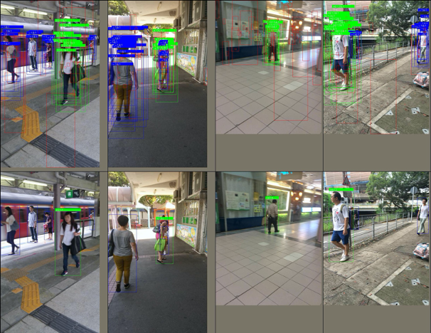

### A PyTorch based strong baseline for Person search
This repository develops a baseline model with high performance, and 
implements the widely used baseline OIM [1], and NAE [4].

- Separating detection and re-ID head on the top of model
- PK sampling for training re-ID head 
- Data Augmentation (paste the same person into different backgrounds)
- Warm-up training 

#### About this repository
- It is pure PyTorch code, which requires the PyTorch version >= 1.1.0
- It supports multi-image batch training.
- End-to-end training and evaluation. Both PRW and CUHK-SYSU are supported.
- Standard protocol (including PRW-mini in [3]) used by most research papers
- Highly extensible (easy to add models, datasets, training methods, etc.)
- Visualization tools (proposals, losses in training)
- High performance baseline.



##### Preparation

- Build environment and clone repository 
```
conda env create -f environment.yml
git clone https://github.com/DeepAlchemist/deep-person-search.git && cd deep-person-search
```
    
- Download  and 
to path_to_your_data and set --data_root to path_to_your_data in the config file

##### Training & Evaluation

- Training

```
CUDA_VISIBLE_DEVICES=0 python main.py \
    --benchmark prw --batch_size 5 \
    --backbone bsl --in_level C5 --cls_type oim \
    --lr 0.003 --warmup_epochs 1 --max_epoch 7 \
    -dis --suffix "" 
```

- Evaluation

```
CUDA_VISIBLE_DEVICES=0 python main.py --is_test \
    --benchmark prw --eval_batch_size 5 \
    --backbone bsl --in_level C5 --cls_type oim \
    --load_ckpt "path_to_your_checkpoint" \
```

#### TODO
- DistributedDataParallel
- Trained model and performance
- Supporting more SOTA methods
- Visualizing ranking list in test
- A technological report for this repository

[1] Joint Detection and Identification Feature Learning for Person Search. In CVPR 2017.<br>
[2] Person Re-Identification in the Wild. In CVPR 2017.<br>
[3] Query-guided End-to-End Person Search. In CVPR 2019.<br>
[4] Norm-Aware Embedding for Efficient Person Search. In CVPR 2020.<br>
